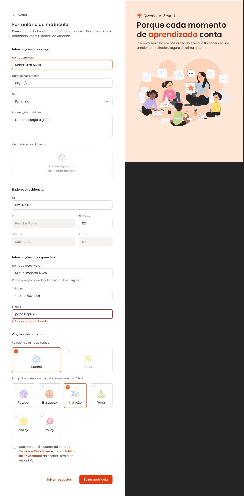

**README.md for Formulário de Matrícula**

# Formulário de Matrícula

Este projeto é um formulário de matrícula desenvolvido como parte do curso Fullstack da Rocketseat. O objetivo é criar uma interface interativa e responsiva para a coleta de informações de matrícula.



## Estrutura do Projeto

A estrutura do repositório é a seguinte:

```
Formulario-De-Matricula/
│
├── assets/                  # Imagens e ícones utilizados no projeto
│
├── node_modules/           # Dependências do projeto
│
├── styles/                 # Arquivos de estilo CSS
│
├── .eslintrc.json          # Configurações do ESLint
├── .gitignore               # Arquivos e pastas a serem ignorados pelo Git
├── .prettierrc             # Configurações do Prettier
├── .stylelintrc.json       # Configurações do Stylelint
├── index.html              # Página principal do formulário
├── package-lock.json       # Lock file para dependências
└── package.json            # Configurações do projeto e dependências
```

## Tecnologias Utilizadas

- **HTML**: Estrutura do formulário
- **CSS**: Estilização do formulário
- **JavaScript**: Interatividade e validação
- **ESLint**: Linter para garantir a qualidade do código
- **Prettier**: Formatador de código
- **Stylelint**: Linter para CSS

## Funcionalidades

- **Validação de Campos**: O formulário possui validações para garantir que os dados inseridos sejam corretos.
- **Responsividade**: O design é responsivo, adaptando-se a diferentes tamanhos de tela.

## Como Executar o Projeto

Para executar o projeto localmente, siga os passos abaixo:

1. **Clone o repositório**:

   ```bash
   git clone https://github.com/PedroJGC/Formulario-De-Matricula.git
   ```

2. **Navegue até o diretório do projeto**:

   ```bash
   cd Formulario-De-Matricula
   ```

3. **Instale as dependências**:

   ```bash
   npm install
   ```

4. **Abra o arquivo `index.html` em um navegador**.

## Licença

Este projeto está licenciado sob a MIT License. Veja o arquivo `LICENSE` para mais detalhes.

---

Sinta-se à vontade para modificar e adaptar este README conforme necessário, Pedro!
